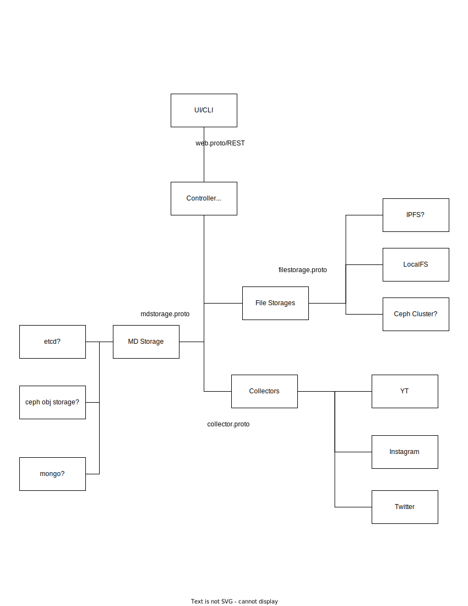

# LOONA The Archive

Archiving all the LOONA content ever produced for posterity. This includes,

1. video of LOONA ever produced
2. video of LOONA ever recorded by fans
3. official social media posts
4. fan social media posts
5. fab posts
6. theory docs
....

## Project Structure

Well there's code that runs the system and there's content contributors who'd add new content on an ongoing basis. Will need some kind of structure to onboard new contributors and make everything publicly available.

???

## Design

This is supposed to be very big project. With disaster resistant storage, content tagging system, content collection system, and easy access to content.
Honestly I have no clue where to even begin.

### Collectors

Components to grab content from various sources, i.e. Instagram, Twitter, YouTube, Facebook (ew but still we need to get stuff from everywhere), Vlive, Discord, Google Drive

Idea would be to define a common API to interact with these collectors. Protobuf all the things!

### Storage Mechanism

Places where content will be stored. Something that's disaster resistant and multi-tenant idk something where one can trust data won't be lost in extreme situations.

### Metadata Service

something to keep record of content metadata integrity signatures etc.

### UI

something to explore, add, and manage content. this scares me.
